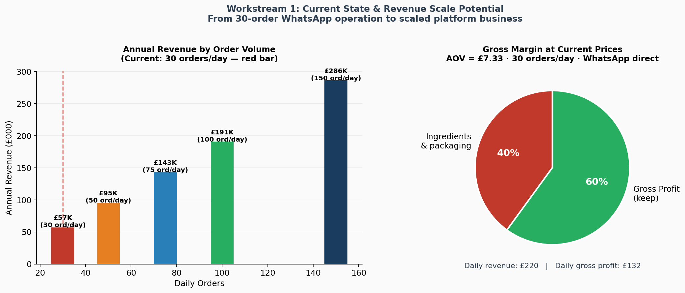
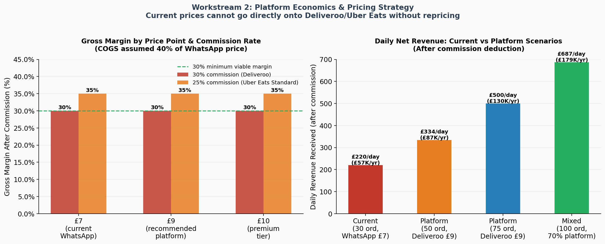
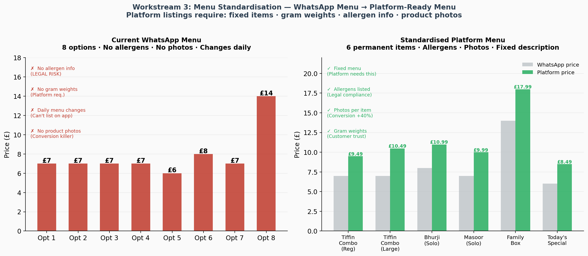
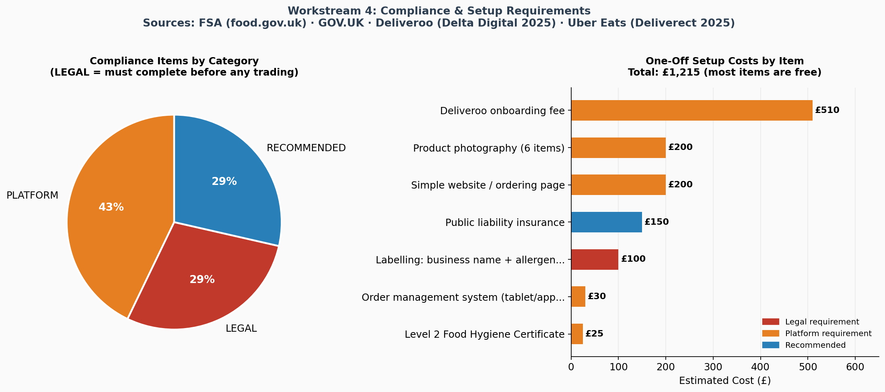
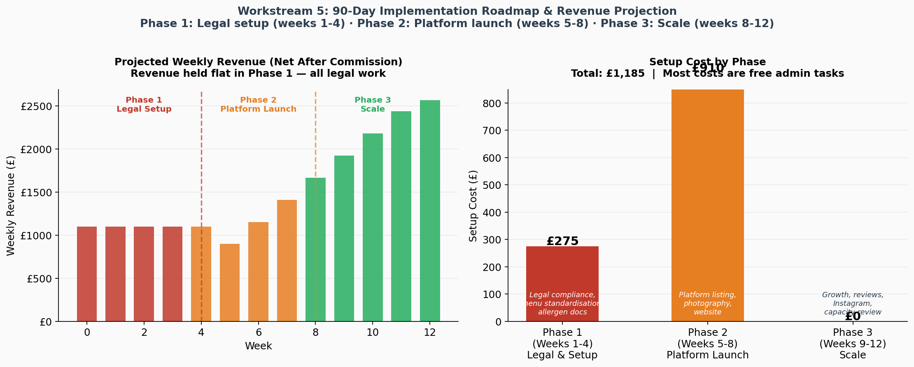
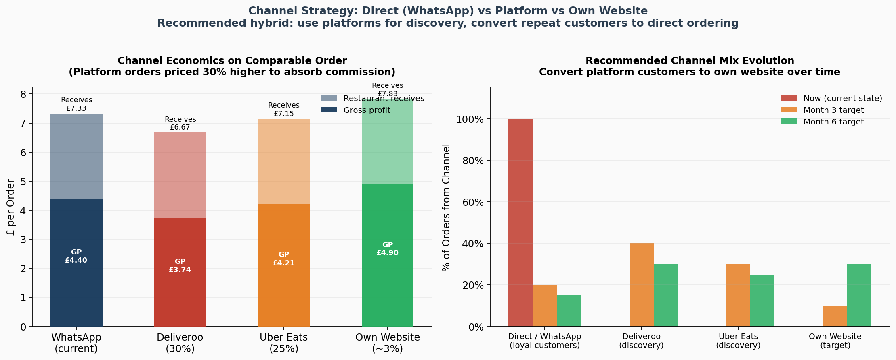

# Business Transformation: Vegetarian Tiffin Home Kitchen → Deliveroo & Uber Eats

**Sector:** F&B · Micro Business · Scale-Up &nbsp;|&nbsp; **Type:** Business Transformation Strategy &nbsp;|&nbsp; **Tools:** Python · Excel · UK regulatory sources

---

## The Brief

A UK home kitchen runs a vegetarian tiffin service — 30 orders per day, taken exclusively via WhatsApp. The menu changes daily (8 options, sent as a WhatsApp message). The founders want to scale onto Deliveroo and Uber Eats while maintaining a vegetarian-only niche.

They have no website, no food business registration, no fixed menu, no allergen documentation, and no order management system beyond WhatsApp.

This project delivers the end-to-end transformation roadmap: legal compliance → pricing strategy → menu standardisation → platform onboarding → 90-day implementation plan.

---

## The Problem This Solves (Issue Tree)

**Root question:** What is the complete roadmap to transform this business from a 30-order WhatsApp operation to a scalable, platform-listed vegetarian food brand?

| Workstream | Question | Finding |
|---|---|---|
| WS1 — Current State | What does the business look like today? | £57K est. annual revenue, 60% gross margin direct. Strong foundation. |
| WS2 — Platform Economics | Do current prices survive 30% commission? | No. £7 WhatsApp prices must become £9+ on platform. |
| WS3 — Menu Standardisation | How does a daily WhatsApp menu become a platform listing? | Consolidate 8 daily options to 6 permanent items + 1 daily special. Add allergens. Get photos. |
| WS4 — Compliance | What does UK law require before going live? | Food business registration (28 days), allergen documentation, food hygiene rating. All currently missing. |
| WS5 — Roadmap | What gets done in what order? | 90-day phased plan: legal first, then platform, then scale. Total setup cost: £1,215. |

---

## Critical Findings

### Finding 1 — The legal work must happen first
UK food businesses, including home-based ones, must register with their local authority. Registration must be done at least 28 days before trading and cannot be refused. This business cannot list on any platform until this is done and a Food Hygiene Rating is obtained. This is the single most important action and has a 28-day minimum clock — it must start immediately.

### Finding 2 — Current prices cannot go onto platforms unchanged
Deliveroo commission for independent UK restaurants averages 25–35%. On a £7 WhatsApp order at 30% commission, the restaurant receives £4.90. After 40% COGS (£2.80), gross profit is £2.10 — a 30% margin. This is workable but thin. The recommended approach: price platform menus 30% higher (£7 → £9), which maintains comparable gross margin to the direct channel. This is standard industry practice.

### Finding 3 — The WhatsApp menu has four blocking problems for platforms
A daily rotating 8-item WhatsApp menu cannot be directly listed on Deliveroo or Uber Eats because: (1) platforms need a permanent fixed listing, (2) UK food businesses are required to provide allergen information for all 14 allergens — currently undocumented, (3) "medium" and "large" without gram weights mean nothing to new customers, and (4) no product photos. Listings without photos convert at 40%+ lower rates.

### Finding 4 — Revenue potential at scale is significant
At 100 orders/day (50 direct + 50 platform), after 30% platform commission, net revenue is approximately £130K/year vs ~£57K today. This requires reaching the order volume — which depends on Food Hygiene Rating, review count, and platform algorithm placement.

### Finding 5 — Use platforms for discovery, not as the permanent channel
The recommended strategy is to use Deliveroo and Uber Eats as paid-acquisition channels, then convert repeat customers to a direct ordering system with lower fees. At 30% commission forever, the economics are tight. The long-term goal is shifting regular customers to a direct website order (Stripe at ~3%).

---

## Honest Assessment

This is not a guaranteed path. Three things will determine whether the platform launch succeeds:

**Food Hygiene Rating.** If the kitchen inspection results in a rating below 3, platform listing is not possible. Every process must be documented using the FSA's 'Safer Food Better Business' pack before the inspector visits.

**Reviews in the first 30 days.** Platform algorithms prioritise restaurants with review volume and high ratings. Mobilising existing WhatsApp customers to place their first order via Deliveroo/Uber Eats and leave a review is the single highest-impact action in Phase 2.

**HMRC compliance.** Since January 2024, Deliveroo and Uber Eats are required to report restaurant revenue directly to HMRC under Digital Platform Reporting Rules. Income from platforms is visible to HMRC. Self-employment registration and tax returns must be up to date.

---

## Recommended Platform Menu (Standardised — 6 Items)

| Item | WhatsApp Price | Platform Price | Key Change |
|---|---|---|---|
| Tiffin Combo (Regular) | £7.00 | £9.49 | +36% — fixed name, allergens, gram weight |
| Tiffin Combo (Large) | £7.00 | £10.49 | Differentiates size clearly |
| Paneer Bhurji (Solo) | £8.00 | £10.99 | Clear solo item with choice of side |
| Masoor Dal (Solo) | £7.00 | £9.99 | Vegan option flagged — niche positioning |
| Family Sharing Box | £14.00 | £17.99 | Premium positioning, high AOV |
| Today's Special | £6.00 | £8.49 | Rotating daily — keeps regulars returning |

---

## 90-Day Roadmap Summary

**Phase 1 (Weeks 1-4) — Legal foundation.** Register food business. HMRC. Level 2 Food Hygiene Certificate. Allergen documentation. HACCP-lite food safety system. Packaging labels. Cost: ~£275.

**Phase 2 (Weeks 5-8) — Platform launch.** Environmental Health inspection (aim for 5 stars). Product photography. Uber Eats application (start here — no fee, faster). Deliveroo application (£510 over 8 payments). Website. Google Business. Soft launch to WhatsApp customers for reviews. Cost: ~£910.

**Phase 3 (Weeks 9-12) — Scale.** Monitor platform metrics. Add Today's Special. Instagram content. Capacity planning for 75+ orders/day. Review P&L channel mix. Cost: £0.

**Total: £1,185 one-off setup cost.** Most items are free admin tasks.

---

## Data Sources

All regulatory and commercial benchmarks are cited to primary sources:

- Food business registration: [food.gov.uk](https://www.food.gov.uk/business-guidance/starting-a-food-business-from-your-home) (FSA)
- HMRC self-employment: [gov.uk](https://www.gov.uk/guidance/starting-a-food-business)
- Deliveroo commission 25–35%: Deliverect 2025; Delta Digital 2025; HomeCooks research
- Deliveroo onboarding fee £510: Delta Digital 2025
- Uber Eats commission 20–30%: Deliverect 2025; Sauce/Restolabs 2025
- Platform digital reporting to HMRC from Jan 2024: PayoutLedger 2026
- Channel conversion strategy: Aexir 2026 (UK restaurant data)

---

## Files

| File | Description |
|---|---|
| `analysis.py` | Full 5-workstream analysis, 6 charts |
| `build_excel.py` | 6-sheet professional workbook builder |
| `outputs/Tiffin_Business_Transformation_VaishnaviBhor.xlsx` | Situation → Pricing → Menu → Compliance → Roadmap → Recommendations |
| `charts/` | 6 charts (PNG) |

---

## Charts

### WS1 — Current State Economics

### WS2 — Platform Economics & Pricing

### WS3 — Menu Standardisation

### WS4 — Compliance Setup

### WS5 — Roadmap & Revenue Projection

### Channel Strategy

---

## About

**Vaishnavi Bhor** — Business & Data Analyst  
MSc Business Analytics, University of Manchester  
[linkedin.com/in/vaishnavi-bhor-business-analyst](https://linkedin.com/in/vaishnavi-bhor-business-analyst) · vbhor207@gmail.com · [vbho.github.io/portfolio](https://vbho.github.io/portfolio)
